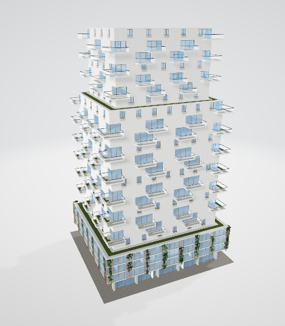
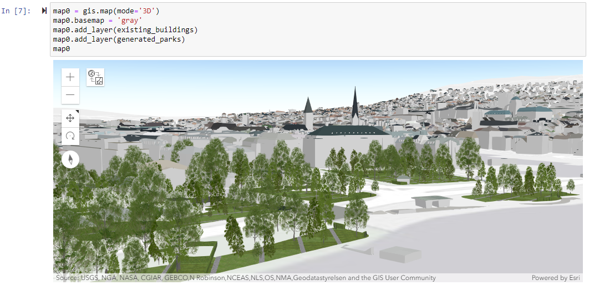

# PyPRT - Python Bindings for CityEngine SDK

PyPRT is a Python binding for PRT (CityEngine Procedural Runtime). It enables the execution of CityEngine CGA rules within Python. PyPRT allows to easily and efficiently generate 3D geometries.

This repo contains examples of PyPRT usage. You can find the source code in the main [pyprt](https://github.com/Esri/pyprt) repository. More detailed information is available there.

  

  

## Table of Contents

* [Installation](#installation)
* [Examples](#examples)
* [Running the examples](#running-the-examples)
* [Ready-to-use Rule Packages](#ready-to-use-rule-packages)
* [License](#license)

## Installation

Simply run `pip install pyprt` in your desired Python environment or `conda install pyprt` in a Conda environment. Then use `import pyprt` in your scripts.

## Examples

<table style="width:100%">
  <tr>
    <th>Name</th>
    <th>Features</th> 
    <th>Notes</th>
  </tr>
  <tr>
    <td>ex1_python_encoder.py</td>
    <td>This example shows the use of the Python encoder and the encoder options for generating (or not) geometries and CGA reports. </td>
    <td> </td>
  </tr>
  <tr>
    <td>ex2_obj_initial_shape.py</td>
    <td>This example demonstrates the use of an OBJ file as initial shape.</td>
    <td> </td>
  </tr>
  <tr>
    <td>ex3_format_exporter.py</td>
    <td>In this example, the generated models are exported as OBJ files using the PRT OBJ exporter.</td>
    <td> </td>
  </tr>
  <tr>
    <td>ex4_multi_generations.py</th>
    <td>This example shows the two ways of calling the generate_model function in case of multiple successive geometry generations.</th> 
    <td> </th>
  </tr>
  <tr>
    <td>ex5_dataset_collection.ipynb</td>
    <td>This example demonstrates how PyPRT can be used to collect a dataset stored as pandas dataframe, using the PyEncoder options.</td>
    <td> </td>
  </tr>
  <tr>
    <td>ex6_3d_visualization_vispy.py</td>
    <td>In this examples, VisPy is used as a mesh visualization tool taking PyPRT generated model (vertices and faces) as input.</td>
    <td> </td>
  </tr>
  <tr>
    <td>ex7_building_modeling_optimization.ipynb</td>
    <td>This example is about optimizing the attributes of a building generated on a parcel considering the green area of the building. SciPy is used as the optimization library.</td>
    <td><a href="https://pypi.org/project/PyGEL3D">PyGEL3D</a> is used as a visualization tool in this example. Unfortunately the pre-built package of PyGEL3D on PyPI is broken for Linux (you can <a href="https://github.com/janba/GEL">try</a> to build it locally).</td>
  </tr>
  <tr>
    <td>ex8_3d_gis_content_generation.ipynb</td>
    <td>This example demonstrates how PyPRT can be used with the <a href="https://developers.arcgis.com/python/">ArcGIS API for Python</a> in order to collect data from <a href="https://www.esri.com/en-us/arcgis/products/arcgis-online/overview">ArcGIS Online</a>, generate 3D content and publish the content back to ArcGIS Online.</td>
    <td>Please note that in order to publish and visualize the generated models, the user needs an <a href="https://www.esri.com/en-us/arcgis/products/create-account">ArcGIS Online account</a>. Also, the published item needs to be manually deleted from the ArcGIS online account before the example script can be run again (we do not want to delete things from your account).</td>
  </tr>
</table>

## Running the examples

To run the examples please follow these steps:
1. Open a terminal and change to the directory where you checked out this repository.
1. Ensure you have a working Python 3.6 64bit installation. For other Python versions, please [build](https://github.com/Esri/pyprt) PyPRT yourself at the moment.
1. Run `pipenv --python 3.6 install` to install PyPRT and all dependencies for the examples. This will download a number of Python packages (including PyPRT) from PyPI.
1. Change into the virtual python environment: `pipenv shell`
1. Now run e.g. `python ex1_python_encoder.py` to execute the corresponding Python script. For the examples based on Jupyter Notebooks, first run `jupyter notebook` and open the desired example notebook in the opening browser page. 

## Ready-to-use Rule Packages

<table style="width:100%">
  <tr>
    <th>Rule Package</th>
    <th>CGB Rule File</th> 
    <th>Shape Attributes and Default Values</th>
    <th>Brief Description</th>
  </tr>
  <tr>
    <td>candler.rpk</td>
    <td>bin/candler.cgb</td>
    <td>BuildingHeight: 62 
		Mode: Visualization" 
		FloorHeight: 3.5 
		GroundfloorHeight: 4.3 
		TileWidth: 3.55 
		CorniceOverhang: 1.2 
		WindowHeight: 2.05 
		FrontWindowWidth: 2.15 
		RearWindowWidth: 1.2 
		SillSize: 0.26 
		CornerWallWidth: 1 
		WallTexture: "facade/walls/bricks.jpg" 
		ColorizeWall: "#FCEFE2"</td>
    <td>Allows generating a "candler" building model, which is textured, detailed and realistic.</td>
  </tr>
  <tr>
    <td>envelope2002.rpk</td>
    <td>rules/typology/envelope2002.cgb</td>
    <td>Density_bonus_height: 60 
		shape_of_building: 1 
		lot_coverage_parameter: 60 
		height_first_tier: 12.2 
		first_setback_size: 3 
		height_second_tier: 40 
		second_setback_size: 3 
		ground_floors_use: "commercial" 
		main_building_use: "residential" 
		create_green_spaces: false 
		report_but_not_display_green: false 
		etc...
	</td>
    <td>Allows generating a realistic and detailed building.</td>
  </tr>
  <tr>
    <td>extrusion_rule.rpk</td>
    <td>bin/extrusion_rule.cgb</td>
    <td>minBuildingHeight: 10 
		maxBuildingHeight: 30 
		buildingColor: "#FF00FF" 
		OBJECTID: 0 
		text: "salut"
	</td>
    <td>Performs a simple extrusion of the initial shape with a height equals to a random number between the min and maxBuildingHeight.</td>
  </tr>
  <tr>
    <td>noRule.rpk</td>
    <td>bin/noRule.cgb</td>
    <td> </td>
    <td>Performs the identity operation.</td>
  </tr>
</table>

## License

PyPRT is under the same license as the included [CityEngine SDK](https://github.com/Esri/esri-cityengine-sdk#licensing).

An exception is the PyPRT source code (without CityEngine SDK, binaries, or object code), which is licensed under the Apache License, Version 2.0 (the “License”); you may not use this work except in compliance with the License. You may obtain a copy of the License at http://www.apache.org/licenses/LICENSE-2.0.

[Back to top](#table-of-contents)

[Go to source code](https://github.com/Esri/pyprt)